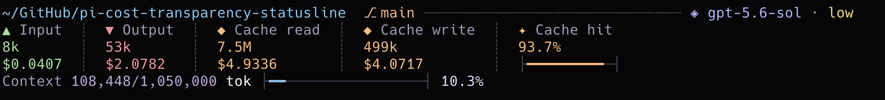

# @nilskluewer/pi-cost-transparency-statusline

A cost transparency status line for the [Pi coding agent](https://pi.dev/).



It replaces Pi's footer with a compact pastel telemetry dashboard that makes token usage and estimated spend transparent:

- current working directory and Git branch
- active model and thinking level
- accumulated input/output/cache-read/cache-write tokens across the session
- cache hit rate with a colored progress rail
- context window usage with a colored progress rail
- estimated cost breakdown: input, output, cache read, cache write, and total

For GitHub Copilot, the statusline uses Pi's current model catalog and recalculates the live estimate from the current session usage.
The catalog is refreshed in the background when a session starts.

A `Cache write 1h` label means that GitHub Copilot reported one-hour prompt-cache writes.
Pi prices those writes at twice the model's base input rate, so Claude Opus 5 cache writes can be `$10/M` instead of the five-minute `$6.25/M` rate.

The dollar values are estimates, not provider invoices.
Subscription and gateway providers can use different billing units, allowances, discounts, or rounding.

## Install

```bash
pi install npm:@nilskluewer/pi-cost-transparency-statusline
```

## Notes

This package was previously published as `@nilskluewer/pi-statusline`.
Use this package going forward.

If you want message wrapping and the live tool side panel too, use `@nilskluewer/pi-terminal-ui` instead.

## License

MIT
